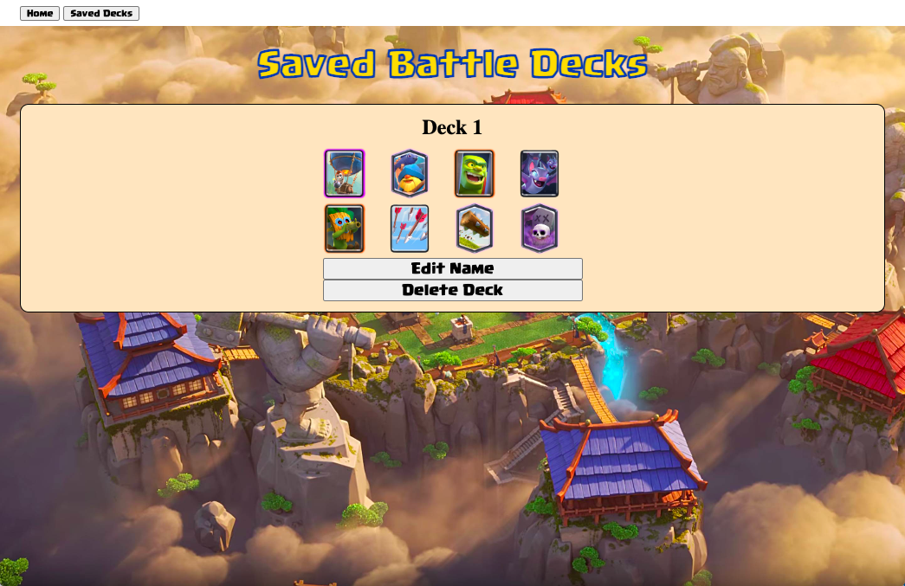

# Clash Royale Deck Generator

Clash Royale Battle Decks: This web application generates random battle decks for the mobile game Clash Royale. The user has the ability to save an unlimited amount of battle decks. The user also can edit the name of their deck and delete any decks.

Technologies Used:

- Node.js
- HTML
- CSS
- Express
- Mongoose
- MongoDB
- EJS

Link to App hosted on Heroku: https://clash-royale-battle-deck.herokuapp.com/

Next Steps:

- Change the styling for the name of the cards
- Hide the save deck button until a deck is generated
- Hide the input after the deck has been saved
- Add scrolling capabilities
- Add a way to edit cards in deck
- Remove duplicate cards from deck generator
- When clicking save deck button more than once, stop from inserting extra inputs
